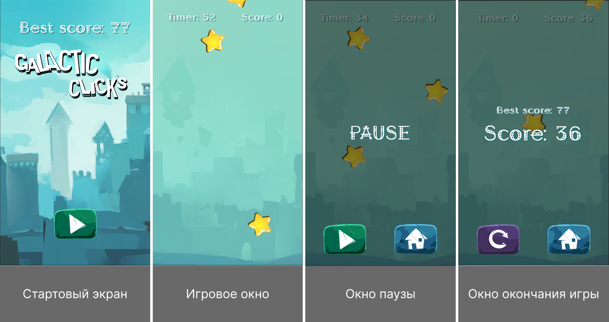

# Выполнение тестового задания
---

## Задание:
---

> Игровой процесс: сверху вниз падают звездочки. Задача игрока кликнуть как можно больше звездочек за отведенное время.
>
> **Звездочки должны появляться:**
> - в случайный момент времени;
> - в верхней части экрана со случайной позицией по ширине;
> - со случайной скоростью падения.
>
> Также в процессе падения они должны вращаться со случайной скоростью.
>
> [Значения всех случайных величин должны находиться в разумных пределах]
>
> При клике на звездочку должен проигрываться какой-нибудь звуковой эффект.
>
> Должна быть реализована возможность поставить игру на паузу с помощью нажатия клавиши Escape.
>
> Должна быть реализована возможность сохранения лучшего результата между игровыми сессиями.
>
> **По поводу UI:**
>
> **Экран меню**
> - лучший результат;
> - кнопка начать игру.
>
> **Экран во время игрового процесса**
> - текущий счет.
>
> **Экран паузы**
> - затемненный фон игрового поля и надпись паузы посередине экрана;
> - кнопка, возвращающая в меню.

## Исполнение
---

## Описание реализации
> ---
> 
>
> **Игра состоит из двух сцен:**
> -  `GameScene` - которая в свою очередь имеет `Игровое окно`, `Окно паузы игры`, `Окно завершения игры` и управляется тремя скриптами `GameManager`, `PauseWindowManager` и `EndGameWindowManager`,
> - `MainMenuScene` - которая в свою очередь управляется скриптом `MainMenuManager`.
>
> На главном экране располагается кнопка `Старта игры`, а так же `Label` отображающий лучший результат игрока.
>
> В игровом окне расположено два элемента `Label` для отображения `Оставшегося времени` и `Текущего счета очков`.
> Главный скрипт программы генерирует элементы `Звёзды` и при помощи генератора случайных чисел задает созданным элементам различающиеся параметры в пределах установленных рамок, а именно: момент появления, место появления, скорость вращения и скорость падения. При помощи обработчиков события отслеживаются нажатия мышки по элементу `Звезда`, который удаляется генерируя звуковой сигнал и прибавляя очки игроку. Так же игроку выделяется 60 секунд на 1 раунд, а по истечению времени появляется окно `EndGameWindow` обновляющее лучший результат (в случае если игрок установил новый рекорд) в котором расположены следующие элементы:
> - `Label` с информацией об набранных очках в текущей игре,
> - `Label` с информацией о предыдущем рекорде,
> - `Button` для перехода на стартовый экран,
> - `Button` для запуска очередного раунда игры
>
> Так же в игре присутствует и возможность приостановить текущий раунд при нажатии на клавишу `ESC`, которая в свою очередь вызывает `PauseWindow` где располагаются следующие элементы:
> - `Label` информирующий что игра приостановлена
> - `Button` для возобновления игры
> - `Button` для перехода на стартовый экран
>
> Так же есть возможность возобновить игру и по повторному нажатию на клавишу `ESC`.

## Структура программы
---
> В нём расположена кнопка старта игры, а так же информация о лучшем результате.

### MainMenuManager
---
> Управление стартовым экраном осуществляется из скрипта `MainMenuManager` в котором располагаются одноименный класс `class MainMenuManager`. Этот класс содержит два метода:
> - `startGame` который вызывается кнопкой старта игры и запускает игровой процесс,
> - `loadUserData` который подгружает данные о прогрессе пользователя в игре из `localStorage`.

### GameManager
---
> Главный игровой скрипт `GameManager` в котором располагаются класса `GameManager`. Класс содержит ряд методов для управления игровым процессом, а именно:
> - `onLoad` - метод отрабатывающий при загрузке компонента,
> - `onDestroy` - метод отрабатывающий при уничтожении компонента,
> - `generateStar` - создаёт звезду со случайными физическими свойствами и позициями,
> - `randomSchedule` - планирует создание звезды через случайный промежуток времени,
> - `generateRandomNumber` - генерирует случайное число с учётом множителя, смещения и опции знака,
> - `destroyNode` - уничтожает указанный узел, если он действителен,
> - `updateScore` - увеличивает текущий счёт на 1 и обновляет текстовое поле для отображения нового значения,
> - `updateTimer` - обновляет таймер и отображает оставшееся время,
> - `onKeyDown` - обрабатывает нажатие клавиши на клавиатуре,
> - `onStarClicked` - обрабатывает событие клика на звезду,
> - `updateUserData` - обновляет данные пользователя в локальном хранилище,
> - `loadUserData` - загружает данные пользователя из локального хранилища,
> - `pauseGame` - ставит игру на паузу,
> - `endGame` - Приостанавливает игровой процесс, обновляет лучший счёт, отображает текущий и лучший счёт, активирует окно завершения игры и отменяет все запланированные колбэки,
> - `resumeGame` - снимает паузу, скрывает окно паузы, перезапускает таймер и генерацию звёзд, а также продолжает игровой цикл,
> - `restartGame` - перезагружает текущую игровую сцену, сбрасывая всё её состояние.

### PauseWindowManager
---
> Этот скрипт отвечает за логику окна паузы и состоит из двух методов:
> - `resumeGame` который получает компонент `GameManager` из текущей сцены и вызывает метод `resumeGame` для продолжения игры,
> - `mainMenu` загружает сцену `MainMenuScene` и останавливает все запланированные действия

### EndGameManager
---
> Скрипт отвечающий за реализацию логики для перехода в главное меню, а так же перезапуск игры и состоит из двух методов:
> - `restartGame` находит компонент `GameManager` на сцене и вызывает метод перезапуска игры
> - `mainMenu` загружает сцену главного меню и отменяет все запланированные задачи

